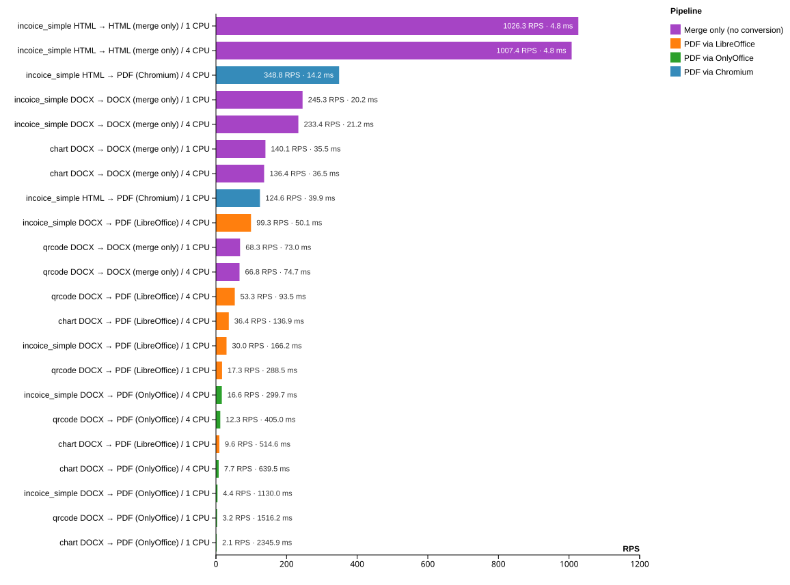

# 📊 Carbone Document Generator Benchmark

> **How fast does Carbone generate documents?** Real templates, real data, with and without PDF conversion, on 1 or 4 CPU.

[](LICENSE)
[](https://k6.io)
[](https://carbone.io)

This repository measures the throughput and the latency of [**Carbone**](https://carbone.io) on a matrix of real document generation jobs. For every template of the [`samples/`](samples) folder, Carbone merges a JSON dataset into the template and, optionally, converts the result to PDF — with **1** or **4** conversion workers.

Everything is reproducible with a single command: `npm run bench`.

---

## 🎯 Results



<!-- BENCHMARK:TABLE:START -->
| Sample | Template | Output | Converter | CPU | Avg latency | p95 | Throughput (RPS) |
| ------ | -------- | ------ | --------- | --- | ----------- | --- | ---------------- |
| `incoice_simple` | HTML | HTML | — | 1 | 4.76ms | 5.81ms | **1026.34** |
| `incoice_simple` | HTML | HTML | — | 4 | 4.84ms | 5.87ms | **1007.42** |
| `incoice_simple` | HTML | PDF | Chromium | 4 | 14.18ms | 16.91ms | **348.82** |
| `incoice_simple` | DOCX | DOCX | — | 1 | 20.21ms | 24.06ms | **245.31** |
| `incoice_simple` | DOCX | DOCX | — | 4 | 21.25ms | 25.39ms | **233.37** |
| `chart` | DOCX | DOCX | — | 1 | 35.49ms | 42.04ms | **140.13** |
| `chart` | DOCX | DOCX | — | 4 | 36.46ms | 43.13ms | **136.43** |
| `incoice_simple` | HTML | PDF | Chromium | 1 | 39.93ms | 42.88ms | **124.60** |
| `incoice_simple` | DOCX | PDF | LibreOffice | 4 | 50.13ms | 58.61ms | **99.28** |
| `qrcode` | DOCX | DOCX | — | 1 | 73.01ms | 89.92ms | **68.31** |
| `qrcode` | DOCX | DOCX | — | 4 | 74.68ms | 95.12ms | **66.77** |
| `qrcode` | DOCX | PDF | LibreOffice | 4 | 93.46ms | 108.47ms | **53.35** |
| `chart` | DOCX | PDF | LibreOffice | 4 | 136.92ms | 183.85ms | **36.38** |
| `incoice_simple` | DOCX | PDF | LibreOffice | 1 | 166.20ms | 176.10ms | **29.98** |
| `qrcode` | DOCX | PDF | LibreOffice | 1 | 288.45ms | 300.58ms | **17.26** |
| `incoice_simple` | DOCX | PDF | OnlyOffice | 4 | 299.73ms | 401.94ms | **16.60** |
| `qrcode` | DOCX | PDF | OnlyOffice | 4 | 405.05ms | 540.17ms | **12.26** |
| `chart` | DOCX | PDF | LibreOffice | 1 | 514.57ms | 539.20ms | **9.65** |
| `chart` | DOCX | PDF | OnlyOffice | 4 | 639.51ms | 939.78ms | **7.73** |
| `incoice_simple` | DOCX | PDF | OnlyOffice | 1 | 1130.00ms | 1173.30ms | **4.36** |
| `qrcode` | DOCX | PDF | OnlyOffice | 1 | 1516.16ms | 1575.93ms | **3.23** |
| `chart` | DOCX | PDF | OnlyOffice | 1 | 2345.92ms | 2466.80ms | **2.07** |

_22 configurations measured with 5 VUs during 30s each, on `carbone/carbone-ee:full-5.12.0`. Full details in [RESULT.md](RESULT.md)._
<!-- BENCHMARK:TABLE:END -->

Raw k6 metrics of every run: [RESULT.md](RESULT.md) · machine readable: [`results/results.csv`](results).

---

## 🔬 What is measured

Each sample is a **template + JSON data** pair. Carbone always merges the data into the template; the PDF conversion is an extra step handled by a dedicated engine:

| Pipeline | `convertTo` | `converter` | Engine |
| -------- | ----------- | ----------- | ------ |
| Merge only (DOCX → DOCX, HTML → HTML) | – | – | Carbone template engine only |
| Office template → PDF | `pdf` | `L` | LibreOffice |
| Office template → PDF | `pdf` | `O` | OnlyOffice |
| Web template → PDF | `pdf` | `C` | Chromium |

The matrix is the cartesian product of:

- **the samples** found in `samples/` (auto-discovered)
- **the pipelines** relevant to the template format (office templates get LibreOffice *and* OnlyOffice, web templates get Chromium)
- **the number of Carbone factories**: `1` and `4` (`carbone webserver -f <n>`, one worker per CPU)

With the samples currently committed, that is **26 runs**. Print the plan without running anything:

```bash
npm run plan
```

### Samples

| Template | Data | Formats benchmarked |
| -------- | ---- | ------------------- |
| `template_incoice_simple.docx` | `template_incoice_simple.json` | merge only, PDF (LibreOffice), PDF (OnlyOffice) |
| `template_incoice_simple.html` | `template_incoice_simple.json` | merge only, PDF (Chromium) |
| `template_chart.docx` | `template_chart.json` | merge only, PDF (LibreOffice), PDF (OnlyOffice) |
| `template_qrcode.docx` | `template_qrcode.json` | merge only, PDF (LibreOffice), PDF (OnlyOffice) |
| `sample_text.html` | – (no data file, `{}` is sent) | merge only, PDF (Chromium) |

Adding a sample requires **no code change**: drop `my_template.docx` and `my_template.json` into `samples/` and they are picked up on the next run. A template without a matching `.json` is rendered with an empty dataset.

---

## 🚀 Getting started

### Prerequisites

- [Docker](https://www.docker.com/get-started) — runs the Carbone server
- [k6](https://k6.io) — generates the load
- [Node.js](https://nodejs.org) ≥ 18 — orchestrates the runs and builds the report (no npm dependency to install)

```bash
# macOS
brew install k6

# Linux
sudo gpg -k
sudo gpg --no-default-keyring --keyring /usr/share/keyrings/k6-archive-keyring.gpg --keyserver hkp://keyserver.ubuntu.com:80 --recv-keys C5AD17C747E3415A3642D57D77C6C491D6AC1D53
echo "deb [signed-by=/usr/share/keyrings/k6-archive-keyring.gpg] https://dl.k6.io/deb stable main" | sudo tee /etc/apt/sources.list.d/k6.list
sudo apt-get update && sudo apt-get install k6

# Windows
choco install k6
```

### Run the full benchmark

```bash
npm run bench
```

The runner does everything: it starts `carbone/carbone-ee:full-5.12.0` with `-f 1`, plays all the samples, restarts the container with `-f 4`, plays them again, removes the container, then writes the chart, the tables and the CSV.

The container is started with the same command as the [manual one](#-running-carbone-by-hand), only detached and named: `docker run -d --name carbone-bench -p 4000:4000 <image> webserver -s -f <n>`. Extra flags are opt-in (`--env`, `--shm-size`, `--docker-cpus`), and the exact command is printed before each start.

### Or start Carbone yourself

If you prefer to control the container (custom flags, remote server, debugging), start it and point the runner at it with `--no-docker`. One factory count per server, since the runner cannot restart it:

```bash
docker run -t -i --rm -p 4000:4000 carbone/carbone-ee:full-5.12.0 webserver -s -f 4
node bench/run.mjs --no-docker --cpus 4
```

Both modes write to the same `results/` folder, so you can run `--cpus 1` and `--cpus 4` in two passes and still get one complete report.

Expect roughly **20 minutes** with the default settings (26 runs × 30s + warmups + container restarts).

```bash
npm run bench:quick          # same matrix, 10s per run, to validate the setup first
npm run report               # rebuild result.svg / RESULT.md / CSV from results/
```

### Options

Every option is a CLI flag, or the matching `CARBONE_*` environment variable.

| Flag | Env variable | Default | Description |
| ---- | ------------ | ------- | ----------- |
| `--cpus <list>` | `CARBONE_CPUS` | `1,4` | Number of Carbone factories to benchmark |
| `--duration <time>` | `CARBONE_DURATION` | `30s` | k6 duration per run |
| `--vus <n>` | `CARBONE_VUS` | `5` | Concurrent virtual users |
| `--filter <text>` | – | – | Only run matrix entries whose id or label contains `<text>` |
| `--image <image>` | `CARBONE_IMAGE` | `carbone/carbone-ee:full-5.12.0` | Carbone Docker image |
| `--port <port>` | `CARBONE_PORT` | `4000` | Host port bound to the container |
| `--container <name>` | `CARBONE_CONTAINER` | `carbone-bench` | Container name |
| `--docker-cpus <n>` | `CARBONE_DOCKER_CPUS` | – | Also cap the container to `n` host CPUs |
| `--license-file <f>` | `CARBONE_LICENSE_FILE` | – | Mount an enterprise license file into the container |
| `--env KEY=VALUE` | – | – | Extra environment variable for the container (repeatable) |
| `--shm-size <size>` | `CARBONE_SHM_SIZE` | – | `/dev/shm` size, ex `1g` — Chromium and LibreOffice like it |
| `--startup-timeout <s>` | `CARBONE_STARTUP_TIMEOUT` | `120` | How long to wait for Carbone to listen |
| `--request-timeout <s>` | `CARBONE_REQUEST_TIMEOUT` | `60` | Give up on a warmup render after n seconds |
| `--warmup <n>` | `CARBONE_WARMUP` | `3` | Valid renders required before measuring |
| `--warmup-retries <n>` | `CARBONE_WARMUP_RETRIES` | `3` | Extra warmup attempts allowed on connection reset |
| `--cooldown <sec>` | `CARBONE_COOLDOWN` | `3` | Pause between runs |
| `--results <dir>` | `CARBONE_RESULTS` | `results` | Where JSON results are written |
| `--no-docker` | – | – | Do not manage Docker, use an already running Carbone |
| `--keep` | – | – | Leave the container running at the end |
| `--dry-run` | – | – | Print the plan and exit |

Examples:

```bash
# Only the invoice sample, 4 CPU, 1 minute per run
node bench/run.mjs --filter incoice --cpus 4 --duration 1m

# Benchmark a Carbone server you started yourself on port 4001
node bench/run.mjs --no-docker --port 4001 --cpus 4

# Compare 1, 2, 4 and 8 factories
node bench/run.mjs --cpus 1,2,4,8
```

### Enterprise license

The runner forwards the license to the container by itself. Use whichever form you already have:

```bash
# v5 environment variable
export CARBONE_LICENSE=$(cat my_license.carbone-license)
npm run bench

# legacy environment variable, still accepted by Carbone
export CARBONE_EE_LICENSE=$(cat my_license.carbone-license)
npm run bench

# or mount the license file, no export needed
node bench/run.mjs --license-file ./my_license.carbone-license
```

`CARBONE_LICENSE` and `CARBONE_EE_LICENSE` are forwarded with `docker run -e <name>`, so the key never appears in the printed command line. `--license-file` mounts the file read-only in the container `config/` directory. The line `license .......` in the runner header tells you which one was picked up.

---

## 🧪 Running Carbone by hand

Useful to check a configuration before launching the whole benchmark.

### 1. Start Carbone

```bash
# 1 worker
docker run -t -i --rm -p 4000:4000 carbone/carbone-ee:full-5.12.0 webserver -s -f 1

# 4 workers
docker run -t -i --rm -p 4000:4000 carbone/carbone-ee:full-5.12.0 webserver -s -f 4
```

### 2. Generate one document

```bash
cd samples
template=$(base64 < template_incoice_simple.docx | tr -d '\r\n')
data=$(cat template_incoice_simple.json)
mime='application/vnd.openxmlformats-officedocument.wordprocessingml.document'

# Merge only, no conversion
curl -s -H 'Content-Type: application/json' \
  -d "{\"data\":${data},\"template\":\"data:${mime};base64,${template}\"}" \
  'http://localhost:4000/render/template?download=true' --output out.docx

# DOCX to PDF with LibreOffice ("L"), or OnlyOffice ("O")
curl -s -H 'Content-Type: application/json' \
  -d "{\"data\":${data},\"template\":\"data:${mime};base64,${template}\",\"convertTo\":\"pdf\",\"converter\":\"L\"}" \
  'http://localhost:4000/render/template?download=true' --output out-libreoffice.pdf

# HTML to PDF with Chromium ("C")
html=$(base64 < template_incoice_simple.html | tr -d '\r\n')
curl -s -H 'Content-Type: application/json' \
  -d "{\"data\":${data},\"template\":\"data:text/html;base64,${html}\",\"convertTo\":\"pdf\",\"converter\":\"C\"}" \
  'http://localhost:4000/render/template?download=true' --output out-chromium.pdf
```

### 3. Run a single k6 test

`bench/carbone-bench.js` reads a ready-made request body, so it can be replayed on its own:

```bash
CARBONE_PAYLOAD=./payload.json CARBONE_VUS=5 CARBONE_DURATION=30s k6 run bench/carbone-bench.js
```

---

## 📁 How it works

| File | Role |
| ---- | ---- |
| [`bench/matrix.mjs`](bench/matrix.mjs) | Discovers the samples, builds the run matrix, builds the Carbone request body |
| [`bench/carbone-bench.js`](bench/carbone-bench.js) | k6 script measuring **one** configuration, exports a JSON summary |
| [`bench/run.mjs`](bench/run.mjs) | Orchestrator: container lifecycle, warmup, k6 runs, JSON results |
| [`bench/report.mjs`](bench/report.mjs) | Builds `result.svg`, `RESULT.md`, `results/results.csv` and the table above |
| `results/` | One JSON file per run + `index.json` (all runs and the test environment) |

Before measuring, the runner renders each configuration until it gets 3 **valid** documents (a PDF must start with `%PDF`, an office document with `PK`). This spawns the LibreOffice / OnlyOffice / Chromium workers before the load starts.

Carbone sometimes resets the connection on the very first render of a kind, while those workers are still spawning. Such failures are retried — a run is skipped only when Carbone never produced a valid document, and the reason is then reported instead of polluting the results.

The request body is built once by Node and posted verbatim by k6, so no base64 encoding or JSON serialization happens inside the load generator — the measured time is Carbone's.

---

## 📊 Methodology

- **Load tool**: [k6](https://k6.io), 5 virtual users, 30s per configuration (both configurable)
- **Endpoint**: `POST /render/template?download=true`, the document is generated *and* downloaded in one call
- **Metrics**: average / median / p90 / p95 / p99 latency, throughput (RPS), failure rate
- **Warmup**: 3 renders per configuration, excluded from the measures
- **Response bodies** are discarded by k6 (`discardResponseBodies`) to keep the load generator cheap
- **Thresholds**: `http_req_failed < 1%` and `p(95) < 10s`; a crossed threshold is reported but the measures are kept

The exact environment (host CPU, Docker and k6 versions, image, date) is recorded in `results/index.json` and printed in [RESULT.md](RESULT.md).

> ⚠️ Benchmarks measure a single Carbone container on a single machine. Absolute numbers depend on your hardware; the interesting part is the **relative** cost of each pipeline (merge only vs PDF, LibreOffice vs OnlyOffice vs Chromium, 1 vs 4 workers).

### Troubleshooting

- **OnlyOffice rows reported as “not available”**: the converter is disabled in the image you used. Point Carbone to the binaries with `CARBONE_ONLY_OFFICE_PATH` (`"x2tPath, AllFontsPath, fontPath"`), or use an image that bundles it.
- **Chromium rows reported as “not available”**: same idea with `CARBONE_CHROME_PATH`.
- **Container exits during startup**: the runner stops right away and prints the container logs — usually an invalid or expired license, or a port already in use.

---

## 🤝 Contributing

Contributions are welcome: add samples, refine the methodology, improve the report. Feel free to open an issue or a pull request.

## 📄 License

Apache License 2.0 — see [LICENSE](LICENSE).

**Made with ❤️ for the open-source community**
